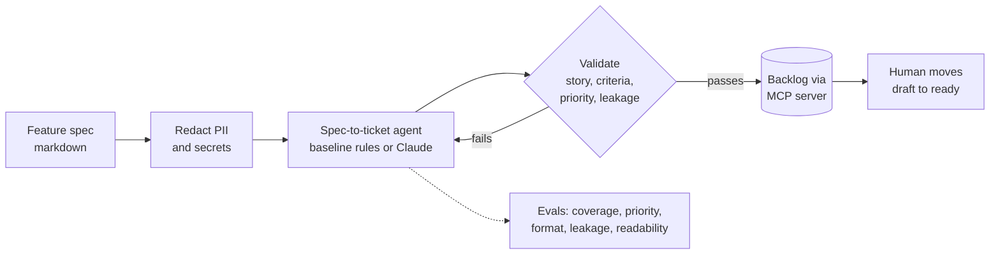

# Agentic SDLC Playbook

**A product manager's playbook for putting AI agents into the software delivery lifecycle of a regulated organisation, with a working spec-to-ticket agent, an MCP server, guardrails and evals.**

> Everything here is rebuilt from scratch on my own time using a fictional payments app ("Payo"). It contains no client code, data, names or proprietary material. The patterns reflect what I've learned leading agentic developer tooling work in financial services.

## Why this exists

Most "AI for developers" pilots stall in regulated organisations for product reasons, not model reasons:

1. **No clear job to be done.** "Use Copilot more" is not a use case. "Turn an approved spec into refined, testable tickets in minutes, not days" is.
2. **No guardrails a risk partner will sign off.** Personal data in prompts, agents writing to systems of record, no audit trail.
3. **No proof it works.** Teams ship a demo, not an eval. Leadership asks "is velocity up?" and nobody can answer.
4. **No way to compare platforms.** Every vendor says "agents". Few can show skills, tools, memory, MCP connectivity and evals in a way you can assess.

This repo is my answer to each of those, in order.

## What's inside

| | What | Where |
|---|---|---|
| 1 | Reference architecture for three SDLC agents (spec to ticket, code generation, test generation) with human approval gates | [docs/reference-architecture.md](docs/reference-architecture.md) |
| 2 | Guardrails checklist for regulated delivery | [docs/guardrails.md](docs/guardrails.md) |
| 3 | How to measure impact with DORA and SPACE, without gaming it | [docs/measuring-impact.md](docs/measuring-impact.md) |
| 4 | Agent primitives scorecard: a vendor neutral way to assess any agent platform | [docs/agent-primitives-scorecard.md](docs/agent-primitives-scorecard.md) |
| 5 | **Working demo:** spec-to-ticket agent, backlog MCP server, guardrails, evals, tests | [demo/](demo/) |

## The demo in 60 seconds

```bash
cd demo
python spec_to_tickets.py examples/payo-split-bill-spec.md       # baseline mode, no API key needed
python evals.py examples/payo-split-bill-spec.md out/tickets.json
python -m unittest discover tests
```



**What happens:**

1. The spec ([example](demo/examples/payo-split-bill-spec.md)) is scanned and a test email address is redacted before anything else touches it.
2. The agent turns each requirement into a ticket with a user story and Given/When/Then acceptance criteria. In `--mode llm` it calls Claude, validates the output, and retries once with the validation errors as feedback.
3. Every ticket is validated. Anything that fails is reported, not silently dropped.
4. The [MCP server](demo/backlog_mcp_server.py) exposes `list_tickets`, `get_ticket` and `create_ticket` to any MCP client (Claude Desktop, Claude Code, VS Code agent mode). Writes go through the same guardrails and always land as `draft`. Only a human can move a ticket to `ready`.
5. [Evals](demo/evals.py) score the output.

**Baseline results** ([full output](demo/examples/baseline-output.md)):

| Eval | Baseline (rules) |
|---|---|
| Requirement coverage | 100% |
| Priority preserved | 100% |
| Format (story and Given/When/Then) | 100% |
| PII leakage | none |
| Spec acceptance criteria reflected | 100% |
| **Story readability** | **71%** |

The interesting number is the last one. The rules based baseline passes every structural check and still writes stories like *"I want to sees a live status"*. That is the product lesson in miniature: **structural evals are necessary but not sufficient.** You need a quality measure too, whether a heuristic, an LLM judge or a human review sample, before you can claim an agent is better than the baseline. Run `--mode llm` with your own API key to compare.

## What I'd tell a team starting this

- **Start with the handoff that hurts most**, usually spec to ticket or ticket to test, not code generation. It has the clearest before and after and the lowest risk.
- **Agents draft, humans approve.** Keep write access narrow and every agent output in a draft state until a person promotes it.
- **Build the eval before the agent.** Agree with engineering and risk what "good" means, then build to it.
- **Measure flow, not keystrokes.** Lead time and change failure rate matter; lines of code generated do not.
- **Prefer open standards (MCP) over bespoke integrations**, so the tool layer survives the next model or vendor switch.

## Status and next steps

- ✅ Spec-to-ticket agent with baseline and LLM modes, guardrails, evals, unit tests, MCP backlog server
- ⏭️ LLM-as-judge eval for story quality, run against a labelled set of specs
- ⏭️ Test generation agent that reads tickets from the MCP server and drafts test cases
- ⏭️ Simple dashboard of eval scores over time

Built with an AI coding assistant as a pair, which is how I prototype. The design, specs, guardrails and eval choices are mine.
