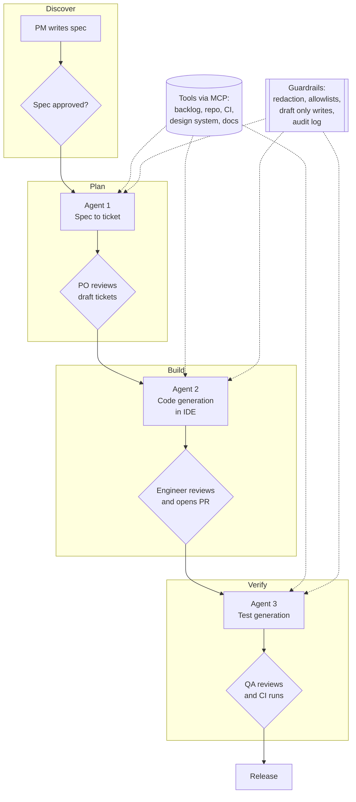

# Reference architecture: three agents across the delivery lifecycle

The aim is not to automate engineers away. It is to remove the slow, low judgement handoffs between stages so people spend time on the high judgement parts.

## The three agents

| Agent | Job to be done | Inputs | Output | Human gate |
|---|---|---|---|---|
| Spec to ticket | Turn an approved spec into refined, estimable tickets | Spec, team ticket standard, existing backlog | Draft tickets with stories and Given/When/Then criteria | Product owner promotes draft to ready |
| Code generation | Produce a first implementation that follows house patterns | Ticket, repo context, coding standards, design system | Branch with changes and a PR description | Engineer reviews, edits and opens PR |
| Test generation | Cover each acceptance criterion with a test | Ticket, changed code, existing test suite | Unit and integration tests mapped to criteria | QA reviews; CI must pass |

## Design principles

1. **Each agent has one job and a narrow tool set.** Easier to evaluate, easier to approve, easier to replace.
2. **Context is engineered, not dumped.** House standards live as reusable instructions (skills or prompt files); repo knowledge comes through tools, not giant pastes.
3. **Tools come through MCP.** The same backlog or repo server works with whichever assistant a team uses.
4. **Every write is a draft.** Agents never promote their own work.
5. **Traceability end to end.** Requirement id → ticket → PR → test, so an auditor can follow the chain.

## Where teams usually start

Spec to ticket first. It is text in, text out, low risk, easy to evaluate, and the time saving is visible in refinement sessions within a sprint. Code generation benefits most once tickets are consistently well formed, which is what agent 1 fixes.
